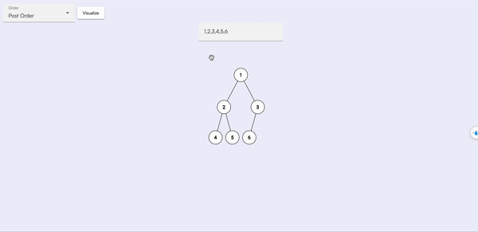

# Binary Tree Visualizer 🌱

The Binary Tree Visualizer is a tool designed to help users convert a given **LeetCode** array representation of a binary tree into a graphical representation.

## Features

- [x] Binary Tree visualization
- [x] Traverse binary tree: in order, post order, pre order
- [x] Convert from **LeetCode** array to binary tree
- [ ] Pause binary tree traversal
